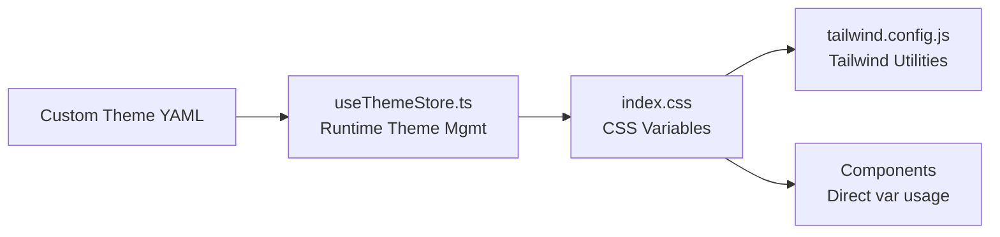

# Theming System Documentation

This document explains how Moss's theming system works and how to customize it.

## Architecture Overview

Amber uses a **CSS Variables-first** approach with three key components:

1. **[src/index.css](file:///Users/ivanowono/Documents/Code/Rusty/Apps/brown/Amber_brown/src/index.css)** - Defines all CSS custom properties (CSS variables)
2. **[tailwind.config.js](file:///Users/ivanowono/Documents/Code/Rusty/Apps/brown/Amber_brown/tailwind.config.js)** - Maps CSS variables to Tailwind utility classes
3. **[useThemeStore.ts](file:///Users/ivanowono/Documents/Code/Rusty/Apps/brown/Amber_brown/src/store/useThemeStore.ts)** - Manages theme switching and applies custom themes



## Color System

### Base Palette

The default "Linen/Earth" palette consists of:

| Variable | Light Mode | Dark Mode | Description |
|----------|-----------|-----------|-------------|
| `--color-linen` | `#f5efe1` | - | Warm off-white |
| `--color-earth` | `#4a3b30` | - | Dark brown |
| `--color-moss` | `#6b7f6c` | - | Muted green |
| `--color-terracotta` | `#a87c7c` | - | Dusty red |
| `--color-honey` | `#e0ba62` | - | Golden yellow |

### Semantic Colors

These map to UI contexts and automatically switch in dark mode:

#### Light Mode (`:root`)
- `--background` → `#f5efe1` (linen)
- `--foreground` → `#4a3b30` (earth)
- `--primary` → `#4a3b30` (earth)
- `--secondary` → `#e8e2d2` (darker linen)
- `--accent` → `#6b7f6c` (moss)
- `--border` → `#dcd6c8` (darker linen)

#### Dark Mode (`.dark`)
- `--background` → `#4a3b30` (earth)
- `--foreground` → `#f5efe1` (linen)
- `--primary` → `#f5efe1` (linen)
- `--secondary` → `#3d3026` (darker earth)
- `--accent` → `#6b7f6c` (moss)
- `--border` → `#5c4b3e` (lighter earth)

### Utility Colors

Used for alerts, statuses, and semantic feedback:

| Color | Light | Dark | Usage |
|-------|-------|------|-------|
| `--success` | `#6b7f6c` (moss) | `#10b981` (emerald) | Success states |
| `--warning` | `#e0ba62` (honey) | `#f59e0b` (amber) | Warnings |
| `--info` | `#3b82f6` (blue) | `#3b82f6` (blue) | Informational |
| `--destructive` | `#a87c7c` (terracotta) | `#a87c7c` (terracotta) | Errors, delete actions |

## Using Colors in Code

### Option 1: Tailwind Utility Classes (Recommended)

All CSS variables are exposed as Tailwind utilities:

```tsx
<div className="bg-background text-foreground border border-border">
  <button className="bg-primary text-primary-foreground">
    Primary Button
  </button>
  <div className="text-success">Success message</div>
  <div className="bg-warning text-warning-foreground">Warning</div>
</div>
```

### Option 2: Direct CSS Variable Usage

For dynamic styles or custom CSS:

```tsx
<div style={{ backgroundColor: 'var(--accent)' }}>
  Accent background
</div>
```

```css
.custom-class {
  color: var(--foreground);
  border-color: var(--border);
}
```

### Option 3: Color Mixing (Advanced)

Use CSS `color-mix()` for opacity/tinting:

```css
.subtle-accent {
  background: color-mix(in srgb, var(--accent), transparent 90%);
}
```

## Creating Custom Themes

### 1. Create a Theme YAML File

Themes are stored in the app's `themes/` directory (in `AppLocalData`).

**Example: `my-theme.yaml`**

```yaml
version: "1.0"
name: "My Custom Theme"
description: "A description of your theme"

colors:
  # Light mode colors
  primary: "#1a1a1a"
  secondary: "#f0f0f0"
  accent: "#007acc"
  background: "#ffffff"
  background_subtle: "#fafafa"
  surface: "#f5f5f5"
  surface_highlight: "#e8e8e8"
  foreground: "#1a1a1a"
  subtle_foreground: "#666666"
  outline: "#cccccc"
  outline_subtle: "#e0e0e0"

utility:
  alert:
    background: "#dc2626"
    foreground: "#ffffff"
    border: "#dc2626"
    subtle_background: "rgba(220, 38, 38, 0.1)"
  success:
    background: "#16a34a"
    foreground: "#ffffff"
    border: "#16a34a"
    subtle_background: "rgba(22, 163, 74, 0.1)"
  warning:
    background: "#ca8a04"
    foreground: "#ffffff"
    border: "#ca8a04"
    subtle_background: "rgba(202, 138, 4, 0.1)"
  info:
    background: "#2563eb"
    foreground: "#ffffff"
    border: "#2563eb"
    subtle_background: "rgba(37, 99, 235, 0.1)"

# Optional: Dark mode overrides
dark:
  background: "#1a1a1a"
  foreground: "#ffffff"
  primary: "#ffffff"
  secondary: "#2a2a2a"
  surface: "#2a2a2a"
  # ... other dark mode colors
```

### 2. Load the Theme

1. Open Settings (⌘+,)
2. Go to "Appearance" tab
3. Click "Reload Themes"
4. Select your custom theme

### 3. Theme Structure Reference

**Required Fields:**
- `version` - Theme format version (currently `"1.0"`)
- `name` - Display name
- `colors` - Light mode color palette
  - `primary`, `secondary`, `accent`, `background`, `foreground` (required)
  - `surface`, `outline`, `subtle_foreground` (recommended)
- `utility` - Alert/status colors
  - `alert`, `success`, `warning`, `info` (each with `background`, `foreground`, `border`, `subtle_background`)

**Optional Fields:**
- `description` - Short description
- `dark` - Dark mode color overrides
- `branding.custom_css` - Custom CSS to inject

## Adding New Colors to the System

If you need to add a new semantic color:

### 1. Add to `index.css`

```css
:root {
  --my-new-color: #ff6b6b;
  --my-new-color-foreground: #ffffff;
}

.dark {
  --my-new-color: #ee5a5a;
  --my-new-color-foreground: #ffffff;
}
```

### 2. Add to `tailwind.config.js`

```javascript
{
  extend: {
    colors: {
      'my-new-color': {
        DEFAULT: "var(--my-new-color)",
        foreground: "var(--my-new-color-foreground)",
      }
    }
  }
}
```

### 3. Use in Components

```tsx
<div className="bg-my-new-color text-my-new-color-foreground">
  New color!
</div>
```

## Dark Mode Toggle

Dark mode is controlled by the `.dark` class on the `<html>` element:

```typescript
// Toggle dark mode
document.documentElement.classList.toggle('dark');

// Check if dark mode is active
const isDark = document.documentElement.classList.contains('dark');
```

The `useTheme` hook handles this automatically.

## Best Practices

1. **Always use CSS variables** - Never hardcode colors in components
2. **Prefer Tailwind utilities** - Use `bg-primary` instead of `style={{ backgroundColor: 'var(--primary)' }}`
3. **Test in dark mode** - Always verify your UI works in both modes
4. **Use semantic names** - Use `--primary` instead of `--blue-500`
5. **Document custom colors** - If adding new variables, explain their purpose
6. **Provide dark mode variants** - Define dark mode colors for all custom variables

## Troubleshooting

### Colors not updating after theme change

- Ensure you're using CSS variables, not hardcoded values
- Check that the variable is defined in both `:root` and `.dark`
- Verify `useThemeStore.applyTheme()` is setting the variables correctly

### Theme YAML not loading

- Check YAML syntax (use a validator like [yamllint.com](https://www.yamllint.com/))
- Ensure file has `.yaml` or `.yml` extension
- Check browser console for parsing errors
- Verify all required fields are present

### Dark mode colors not applying

- Ensure `.dark` class is on `<html>` element
- Check that dark mode overrides are defined in `index.css`
- Verify theme YAML has a `dark` section if overriding defaults

### Tailwind class not working

- Check that the color is defined in `tailwind.config.js`
- Rebuild Tailwind: `npm run dev` or `npm run build`
- Ensure the utility class name matches the config (e.g., `bg-my-color` for `colors: { 'my-color': ... }`)

## Reference Files

- [src/index.css](file:///Users/ivanowono/Documents/Code/Rusty/Apps/brown/Amber_brown/src/index.css#L1-L120) - CSS variable definitions (lines 1-120)
- [tailwind.config.js](file:///Users/ivanowono/Documents/Code/Rusty/Apps/brown/Amber_brown/tailwind.config.js#L7-L65) - Tailwind theme extension (lines 7-65)
- [src/store/useThemeStore.ts](file:///Users/ivanowono/Documents/Code/Rusty/Apps/brown/Amber_brown/src/store/useThemeStore.ts) - Theme management logic
- [src/hooks/useTheme.ts](file:///Users/ivanowono/Documents/Code/Rusty/Apps/brown/Amber_brown/src/hooks/useTheme.ts) - Theme hook for components
- [src/types/theme.ts](file:///Users/ivanowono/Documents/Code/Rusty/Apps/brown/Amber_brown/src/types/theme.ts) - Theme type definitions
